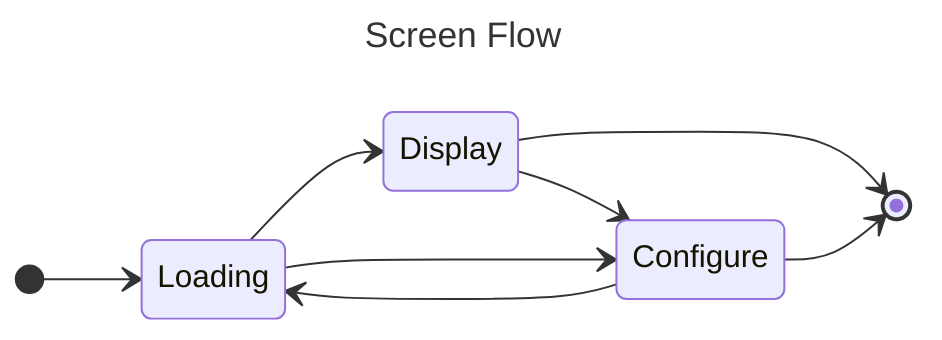

# Patricia's File Name Screen Saver
## Features
- screensaver or app
- multiple project configurations
- keypresses to mark for save, delete, or clear
- keypresses to move marked files, configure, quit, or pause/resume
- display history with keypresses to move back/forth through history
- seed-controlled pseudo-random sequence
- configurable delay
- optional name, id, and/or sequence display
- filtering by name, sequence, id, or shown time

## Process

### Loading
When the app starts, the first thing it does is to start a web UI with a fullscreen blank page and run the frontend javascript main. The main manipulates the page via it's DOM. The UI runs on a different thread listening for messages from input devices and the backend app. This design is essentially the same as Electron.

Meanwhile, the backend looks for a JSON configuration file named `pfnss.local` in the same directory as the executable. If it exists, it is parsed and settings will be updated from their defaults.

As the frontend finishes initialization, it attempts to load the next image. If there is no database initialized, the configuration form is displayed so that a picture directory can be specified - along with any other changes. If the dialog is canceled at this point, the app will terminate. Otherwise (if the changes were submitted), the picture directory is scanned and a new database is created which is populated with the files found. Then the first image (or the next if it is an existing database) is loaded and the timer started. The backend gets the name of the image from the database and sends a message to the UI to load and render it.

A log entry is made as an image file name is fetched from the database to be rendered. This log entry enables searching for images by time shown.

All subdirectories of the picture directory are scanned for `.jpg` files. During scanning to populate the database, each file name is assigned an unique ID.

Each time the database is loaded, the ID's are put into an array in memory and shuffled using the configured shuffle key. These shuffled ID's form the random order presented while loading and rendering. 

### Display
The sequence number is the index into the shuffled array. By knowing the last item loaded before the app terminated, it's sequence number can be determined while rebuilding the array and set as the first file to display when restarting.

### Configure
The display can be paused so that a configuration dialog is presented. This includes the following settings which are persisted in the JSON file:
- Project file - the name and location of the project file
- Picture Directory - the parent directory of where the `.jpg` files are to be found
- Shuffle seed - the random shuffle seed, the same value will repeat the random order
- Replace this - a regex pattern to look for in each file's name
- With this - the replacement value to insert instead
- Search parameters (described below)
- Display options - show a badge for ID, file name, and/or sequence number along with the image

## Marks
There are presently several types of marks (`s` - save, `d` - delete, `e` - edit) which can be made while an image is being displayed. The marks are all kept in a timestamped log. There is also a pseudo-mark (`r` - reset) to clear the mark. The most recent mark can be displayed with the image.

The marked files are not immediately processed. Files marked for save, delete, or edit will be moved into special subdirectories of the main picture directory. _Note `edit` has not been fully implemented yet._ These subdirectories are named: `PFNSS_Save`, `PFNSS_Delete`, `PFNSS_Edit` These subdirectories are skipped by the directory scanner used to rebuild the database.

## Database
Unlike other screensavers which present a slideshow of a subset of images in a single directory, and which randomly redisplays the same image: `PFNSS` shows **all** of the `.jpg` files in a directory and its subdirectories in a random sequence which assures that a given file is only shown **once**.

Since it is often the case that an image of interest is shown, the timer can be paused/resumed and/or the display sequence can be reversed. Images of interest can be marked (or the mark cleared) and eventually moved out of the display sequence.

Searching by several attributes is also provided:
- By ID
- By sequence number
- By name
- By time shown

Search results do not modify the database. They simply recreate the ID array to include the files found by the search.

The project file is a `SQLite` database with these table definitions:
```sql
CREATE TABLE files (id integer primary key autoincrement, name);
CREATE TABLE log(ts,file_id integer not null);
CREATE TABLE marks(ts,file_id integer not null,mark);
CREATE TABLE IF NOT EXISTS info(file_id integer primary key, name text, description text, categories text);
```

Note that `files.name` is conditioned as needed for the web UI to be able to find and display the image. There is a configurable replacement (`regex`) pattern and a replacement string to help with this; but these are seldom needed if the `files` have been populated with the built-in directory scanner.
## Prototype
Written in Python using Tkinter with a Go wrapper. Only .ini file support
## V1
Written entirely in Go using Wails for the UI. Provides a configuration screen.
## V2
Considering Java, C++, Godot 4.1, or Python - settled on Python and Tkinter frozen by PyInstaller

### Fixes
- file name search
- log to server
- status of move processing
- status of DB creation
- icon
- no click (mouse move to stop) **DONE**
- categories for save  **DONE**
- DB creation **DONE**
- metadata / notes **DONE**
